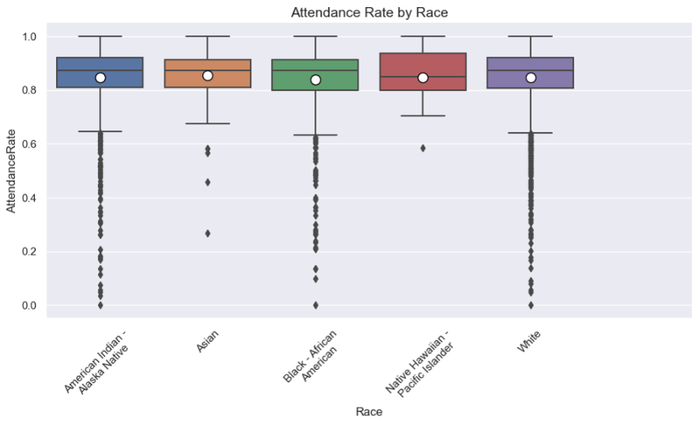
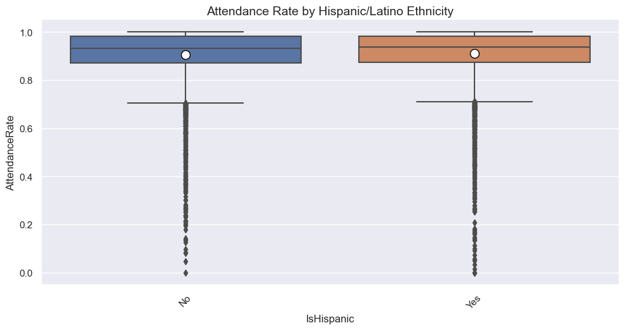
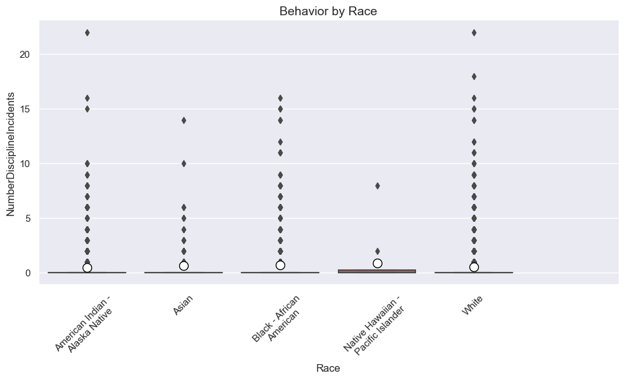

# Analysis of the Ed-Fi Alliance Sample Data Sets

## Introduction

This report provides an analysis of sample data sets provided by the Ed-Fi Alliance. The focus is on the evaluation of sample data sets, equity analysis, and the implications of the findings for educational data systems. The statistical analysis tools have been shared under the Apache License, version 2, in the [Sample Data Equity Equity Analysis](https://github.com/Ed-Fi-Exchange-OSS/Sample-Data-Equity-Analysis) code repository.

## Sample Data Sets

The Ed-Fi Alliance provides three stock sample data sets in the form of pre-populated ODS databases.

- Grand Bend: This data set contains 2,000 records and is described as a "populated template" with unknown provenance.
- Northridge: This data set includes 21,000 records and is statistically generated from the Sample Data Generator.
- Glendale: This data set comprises 48,000 records and is anonymized from Ed-Fi version 1.

Only the Glendale data set is used in this analysis. This data set was created around 2011 from anonymized data at a real medium-sized school district.

## Analysis

The equity analysis focuses on identifying potential biases and disparities within the sample data sets using three hypotheses.

### Attendance Rate by Race

The hypothesis that the difference in attendance rates by race is not statistically significant in the Glendale data set was upheld, with an ANOVA _p_-value of 0.239.

### Attendance Rate for Hispanic/Latino Students

The hypothesis that there is no statistically significant difference in attendance rates for Hispanic/Latino students was rejected, with a T-test _p_-value of 0.025, indicating a significant difference.

### Discipline Incidents by Race

The hypothesis that there is no statistically significant difference in the number of discipline incidents by race was rejected, with an ANOVA _p_-value of 0.019.

### Pairwise Comparison

The comparative analysis uses Tukey’s HSD and Cohen’s D effect size methods to compare equity across different label pairs.

| Label 1                   | Label 2                        | Stat  | p Value | Low CI | High CI | Effect Size          |
|---------------------------|--------------------------------|-------|---------|--------|---------|----------------------|
| Asian                     | American Indian - Alaska Native| 0.164 | 0.737   | -0.248 | 0.575   | n/a                  |
| Asian                     | White                          | 0.123 | 0.861   | -0.28  | 0.527   | n/a                  |
| Black - African American  | American Indian - Alaska Native| 0.216 | 0.017   | 0.028  | 0.403   | ('0.122', 'Small')   |
| Black - African American  | Asian                          | 0.052 | 0.989   | -0.37  | 0.474   | n/a                  |
| Black - African American  | White                          | 0.175 | 0.038   | 0.007  | 0.344   | ('0.101', 'Small')   |
| White                     | American Indian - Alaska Native| 0.04  | 0.886   | -0.102 | 0.182   | n/a                  |

## Discussion

These measures show one area of statistical difference between populations: the attendance rate by Hispanic/Latino Ethnicity, by a very small margin, does have show a statistically significant difference. Because the data set was extracted from real world data, not synthesized, this small difference is assumed to represent other underlying factors in that locality, to which Latino ethnicity is correlated.

Although representing real-world data in some sense, the anonymization process also means that the relationships cannot be trusted for any training purposes, e.g. AI/ML workloads.

Other hypotheses were considered but not evaluated due to insufficient data in this set, for example representing disabilities or participation in special education programs.

## Conclusion

The data equity analysis conducted during the Ed-Fi Alliance SUMMIT 2022 highlights the importance of evaluating sample data sets for potential biases and disparities. The findings underscore the need for ongoing monitoring and analysis to ensure equitable educational outcomes for all students.
